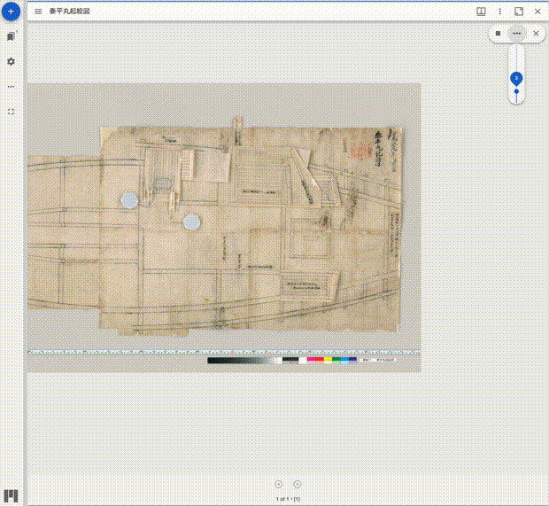

# mirador-layer-slideshow

<!-- 
[](https://badge.fury.io/js/mirador-layer-slideshow) -->


`mirador-layer-slideshow` is a [Mirador 3](https://github.com/projectmirador/mirador) plugin that adds layer slideshow.

<!--  -->


## Configuration
Several configuration options are available on windows that use mirador-layer-slideshow.


Configuration | type | default | description
--- | --- | --- | ---
`layerSlideshowEnabled` | boolean | false | Enable the plugin to be shown

Example configuration:

```javascript
const config = {
  id: 'demo',
  windows: [{
    layerSlideshowEnabled: true,
    manifestId: 'https://gist.githubusercontent.com/nakamura196/0c6a28d03b34d18165bb0d4940673b7e/raw/9cf148fbf8df6cee43debaafd9a47d8757e9380a/kaishi.json',
  }]
};
```
## Installing `mirador-layer-slideshow`

`mirador-layer-slideshow` requires an instance of Mirador 3. See the [Mirador wiki](https://github.com/ProjectMirador/mirador/wiki) for examples of embedding Mirador within an application. See the [live demo's index.js](https://github.com/nakamura196/mirador-layer-slideshow-plugin/blob/main/demo/src/index.js) for an example of importing the `mirador-layer-slideshow` plugin and configuring the adapter.

## Contribute
Mirador's development, design, and maintenance is driven by community needs and ongoing feedback and discussion. Join us at our regularly scheduled community calls, on [IIIF slack #mirador](http://bit.ly/iiif-slack), or the [mirador-tech](https://groups.google.com/forum/#!forum/mirador-tech) and [iiif-discuss](https://groups.google.com/forum/#!forum/iiif-discuss) mailing lists. To suggest features, report bugs, and clarify usage, please submit a GitHub issue.
