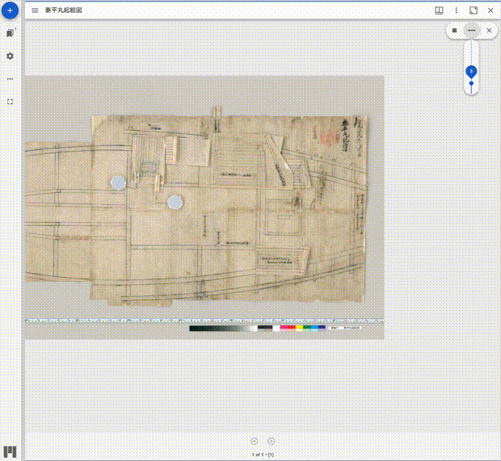

# mirador-layer-slideshow

`mirador-layer-slideshow` is a [Mirador 4](https://github.com/projectmirador/mirador) plugin that adds a layer slideshow to the OpenSeadragon viewer.

IIIF マニフェストの canvas が複数の画像レイヤー（IIIF image choice、または canvas 上に重なる複数の painting annotation）を持つ場合に、それらを順番に重ねて表示するスライドショー機能を Mirador 4 のビューアに追加するプラグインです。



## 🌐 Website / デモ

[Visit the demo page](https://nakamura196.github.io/mirador-layer-slideshow-plugin/) to try it out.

The demo loads a bundled sample manifest (東京大学駒場図書館「泰平丸起絵図」). You
can load any IIIF manifest with the `manifest` query parameter:

```
https://nakamura196.github.io/mirador-layer-slideshow-plugin/?manifest=https://example.com/manifest.json
```

## 📦 Installation / インストール

```bash
npm install mirador-layer-slideshow
```

`mirador-layer-slideshow` requires an instance of Mirador 4. See the
[Mirador wiki](https://github.com/ProjectMirador/mirador/wiki) for examples of
embedding Mirador within an application.

## 🚀 Usage / 使い方

```js
import Mirador from 'mirador';
import miradorLayerSlideshowPlugin from 'mirador-layer-slideshow';

Mirador.viewer(
  {
    id: 'demo',
    windows: [
      {
        layerSlideshowEnabled: true,
        manifestId: 'https://example.com/manifest.json',
      },
    ],
  },
  miradorLayerSlideshowPlugin
);
```

## 📖 Configuration / 設定

Several configuration options are available on windows that use
`mirador-layer-slideshow`.

| Configuration | type | default | description |
| --- | --- | --- | --- |
| `layerSlideshowEnabled` | boolean | `false` | Enable the plugin to be shown |

The plugin can also be toggled at runtime from the window's plugin menu
(the **⋮** menu in the window top bar).

## 🛠 Development / 開発

```bash
npm install
npm run dev         # Vite 開発サーバを起動
npm run build       # ライブラリをビルド (dist/)
npm run build:demo  # GitHub Pages 用デモをビルド (docs/)
```

## 🧩 How it works / 動作の仕組み

This plugin registers two Mirador 4 plugins:

1. An `add`-mode plugin on `OpenSeadragonViewer` that renders the slideshow
   control panel (start / stop button and a `current / total` progress counter).
2. An `add`-mode plugin on `WindowTopBarPluginMenu` that adds a menu item to
   show / hide the panel.

The slideshow reads the image layers of a canvas (IIIF Presentation API 2.x
`sequences` / `canvases` / `images` structure), reveals them cumulatively by
toggling layer visibility via the `updateLayers` action, and pans the viewport
to each newly revealed layer's target region.

## 📣 Contribute

Mirador's development, design, and maintenance is driven by community needs and
ongoing feedback and discussion. To suggest features, report bugs, and clarify
usage, please submit a GitHub issue.

## 🏅 License

Apache-2.0
